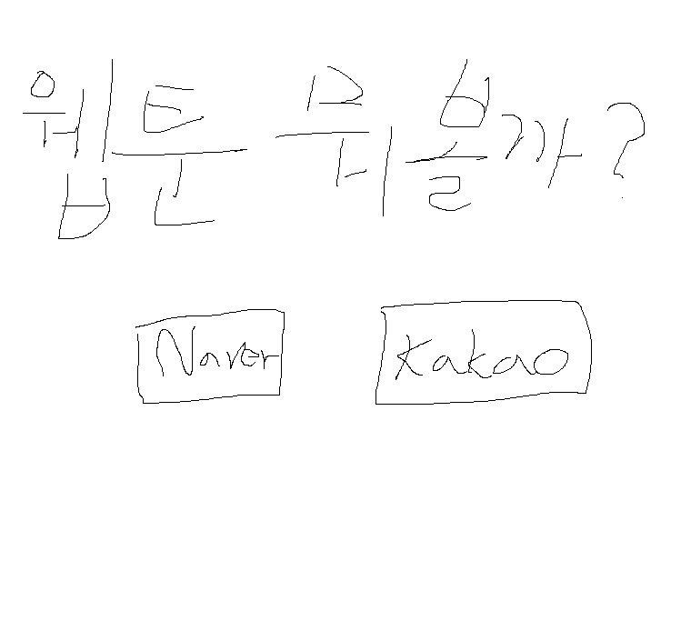
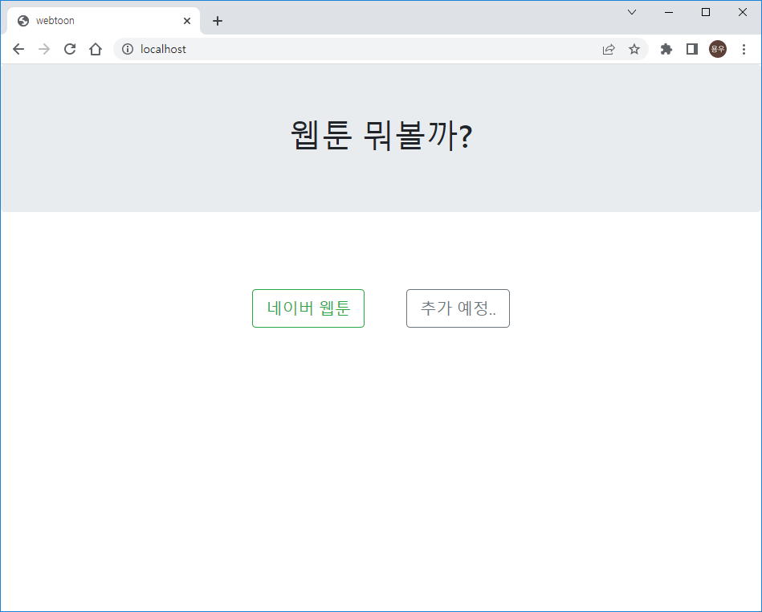
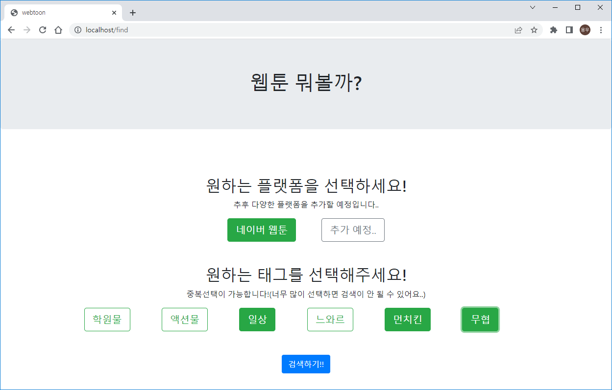
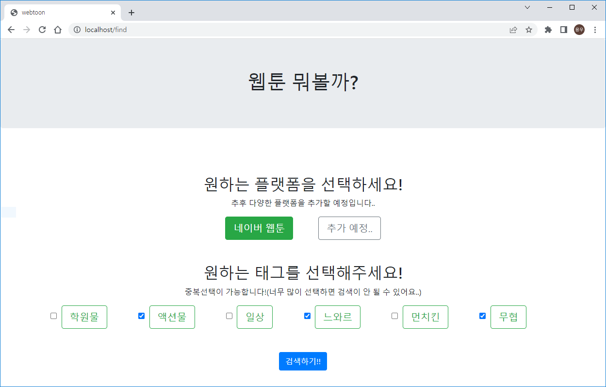

2022-06-09

구체적인 디자인은 추후에 수정하고 우선 페이지를 구현하는게 목표

------------------

메인페이지에서 웹툰 플랫폼을 고를 수 있게하고

플랫폼을 고르면 태그를 선택할 수 있는 창으로 이동.

구현한 메인페이지

- 플랫폼을 선택하면 해당 플랫폼웹툰을 태그로 검색하는 페이지로 이동

구현한 태그검색 페이지

- form태그의 체크박스를 활용해 태그를 선택하면 색이변하면서 체크가 되고 다시 누르면 색이 돌아오고 체크해제하기를 구현
- 검색하기를 누르면 submit

[^]: 체크박스는 디자인이 별로여서 보이지 않도록 했다.

--------------------------------------

spring boot, jsp, bootstrap ,javascript, jquery를 사용해 구현하였다.

태그버튼을 클릭할 때마다 색이 변하고 선택된 버튼들을 submit하도록 구현 하는게 꽤 어려웠는데 form태그의 체크박스를 활용했고 체크박스의 input을 보이지 않게 하여 디자인을 조금 낫게 만들었다.

처음에는 버튼을 누를때마다 input의 checked를 true,false로 바뀌게 구현했는데 버튼 옆에 input이 보이진 않지만 클릭할시 체크가 되는 오클릭 방지를 위해 submit을 보낼 때 버튼이 눌려있는지 확인하고 checked를 수정해서 submit하는 것으로 해결하였다.