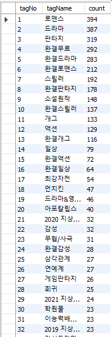
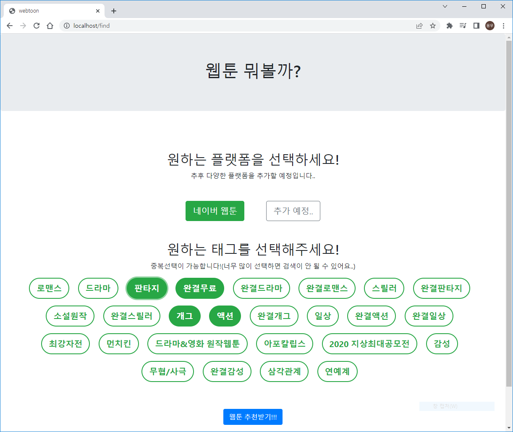
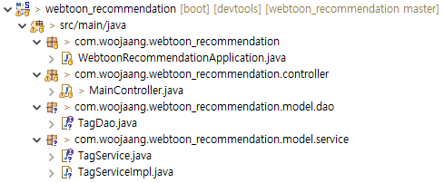

2022-06-10~2022-06-12

현재 태그들을 임의로 만들어 놨는데 db에 웹툰태그들을 추가해두고 화면딴에서 태그들을 리스트로 받아와서 화면에 태그들을 생성하는게 목표

-----------------------------------------

db에 태그생성 완료

db -> dao -> service -> controller 순으로 단순히 String으로 tagName(키워드)를 받아오게 만들었다.

화면에는 상위 20개를 뿌리주었고 sumbit하면 선택한 키워드를 배열로 받아온다.

---------

jsp에서 제이쿼리로 버튼 객체를 탐색해서 체크된 부분만 submit시키는 부분을 고치는데 시간이 많이 들었다.

간단한 코드를 실수했는데 틀린 부분을 찾으면서 많이 배우는 기회가 됐다.