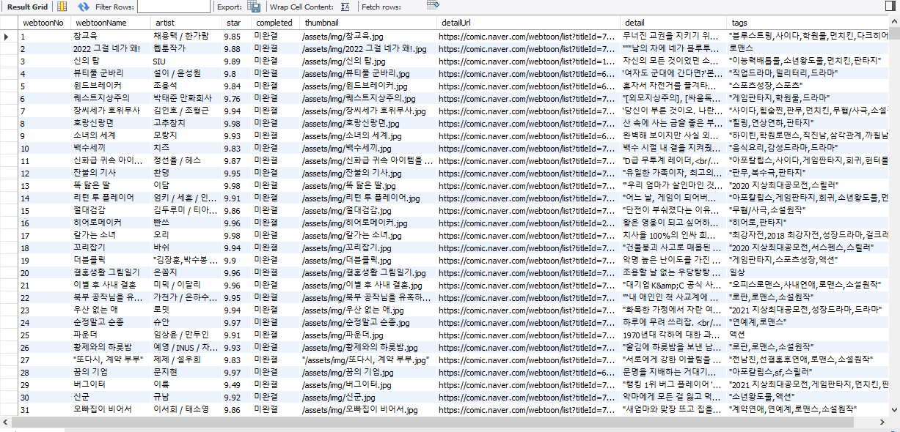
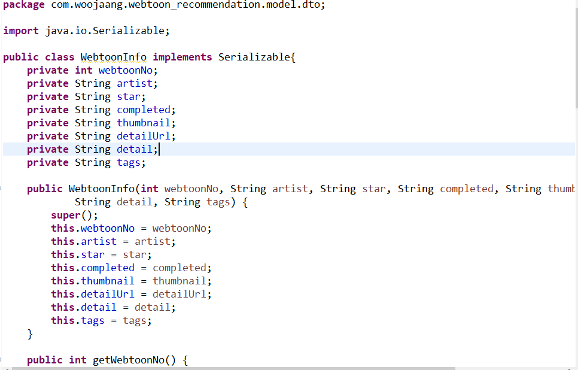
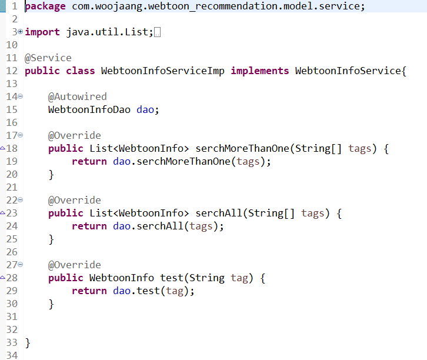
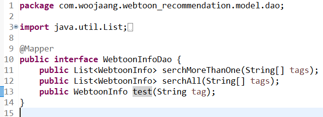
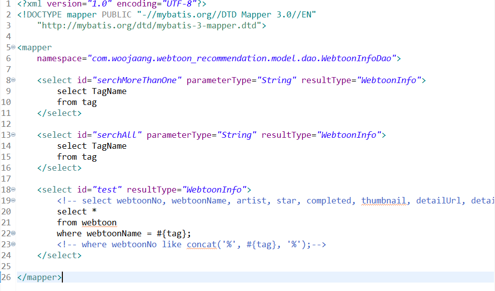

db구축 마무리가 목표

---

1787개 웹툰 db구축 완료.

한 웹툰이 여러개의 tag를 가지고있어서 String으로 넣어두고 where like를 사용해서 포함하는지 검색하는법을 선택.

다음엔 테이블을 따로만들어 웹툰-tag가 1:1로 연결되는 방식도 사용해보면 좋을 것 같음.

dto 생성

service생성

dao생성

mapper생성

test를 만들어서 한개의 dto를 제대로 가져오는지 테스트 완료.

다음으로 여러개를 List로 받아오는 것들을 구현할 예정(serchAll,serchMoreThanOne)

---

Error attempting to get column 'artist' from result set. Cause: java.sql.SQLDataException: Cannot determine value type from string '네이버 웹툰 작가' ;

이러한 오류를 만나서 고치는데 꽤 시간이 걸렸다. 문제는 'artist'가 아닌 다른 column에 있었다. spring boot는 하나하나 구현할때마다 테스트를 하면서 진행하는게 중요하다는 것을 한번 더 느꼈다.

properties에 mybatis.type-aliases-package를 설정하지 않고 그냥 class이름만 사용해서 오류를 고치는데 시간이 걸렸다. 객체 생성에 문제가 있다는 오류가나와 어노테이션에서 계속 오류를 찾으려고 했었다. 역시 하나씩 구현하면서 바로바로 실행을 해봐야겠다.

