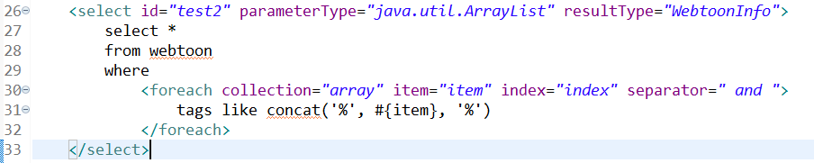
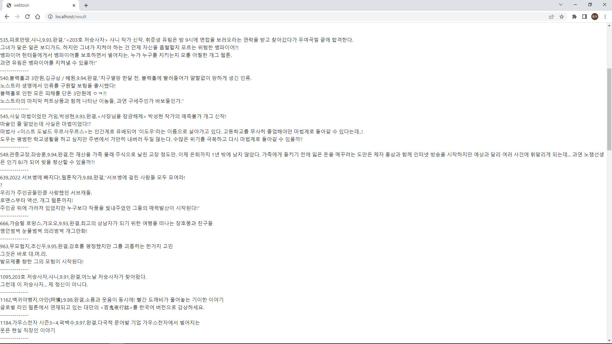

여러개의 키워드를 배열로 넣어서 db에서 list형태로 받아오는 것 구현이 목표

---

배열을 파라미터로 넣는것 테스트 완료

parameterType을 ArrayList로 해주고 foreach를 사용했다.

리스트로 받아오는것 테스트 완료

두 가지 기능별로 쿼리문을 약간씩 수정만 해서 화면에 뿌려주면 될 것같다.

----------

기본적인 기능들을 만들어보면서 계속 익숙해져 가는 과정이라고 생각한다.