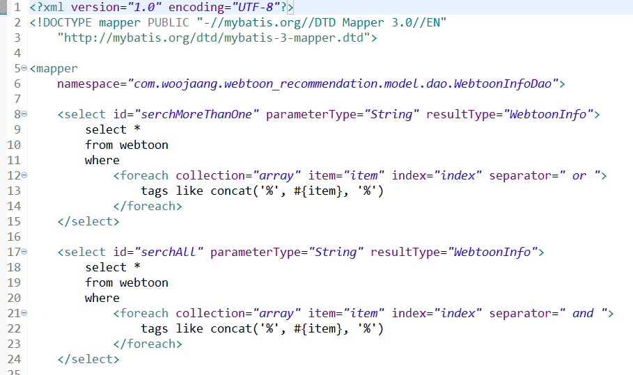
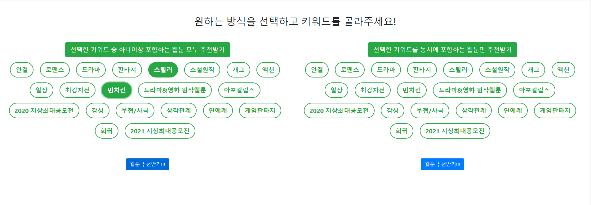
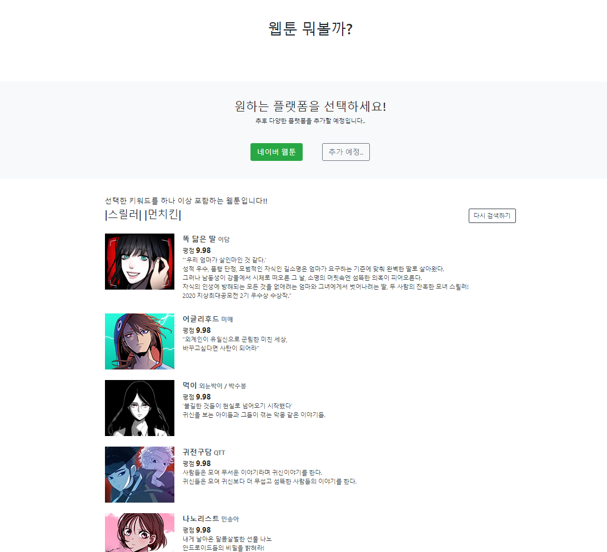
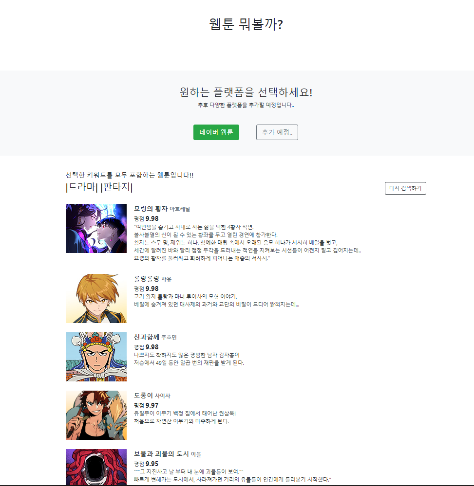
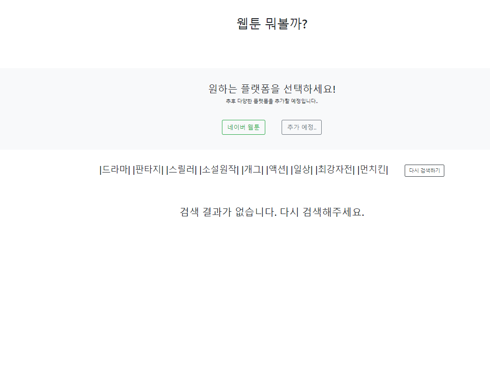

두가지 방식으로 태그로 웹툰을 db에서 검색해서 list로 받아오는 기능 구현이 목표

---

두가지 방법 구현 완료

두 가지 방식 중 한 가지 선택

선택한 키워드를 하나 이상 포함하는 웹툰 리스트

선택한 키워드를 모두 포함하는 웹툰 리스트

검색된 웹툰을 별점 순으로 정렬 후 상위 50개까지 표시되게 하였다.

검색 실패 화면

-------

일단 메인 기능은 구현이 끝났다.

UI를 수정해야 할 부분도 많고 코드도 수정해야 할 부분이 많지만 우선은 배포부터 진행을 해보고 수정은 차차 진행할 예정이다.